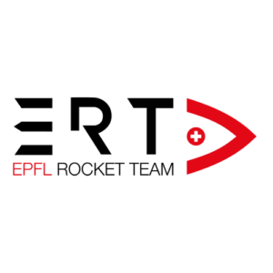

# Update Report Generation Procedure 
#### Author: Martin Lemaire
#### Sub-System: C - Flight Dynamics

**Step 1: Data Preparation**
1.1. Check the file "report_data.csv" to ensure it contains the necessary data for the report.

**Step 2: Simulation and Data Processing**
2.1. Run the script "RPy_SIM_R04.py" to perform the rocket simulation.

**Step 3: Figure Generation**
3.1. Save the following figures in the folder "report_images":

"thrust.png"
"3D_trajectory.png"
"acceleration.png"
"velocity.png"
"altitude.png"

**Step 4: Rocket Schematic Capture**
4.1. Take a screenshot of the rocket schematic in OpenRocket.
4.2. Save the screenshot as "rocket.png" in the folder "report_images."

**Step 5: Report Compilation**
5.1. Run the script "report_generator.py" to compile the report.

**Step 6: Final Report**
6.1. Review the generated report for accuracy and completeness.
6.2. Make any necessary adjustments to the report content or format.
6.3. Save the final report in the desired location.